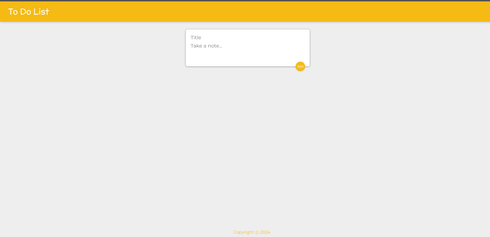
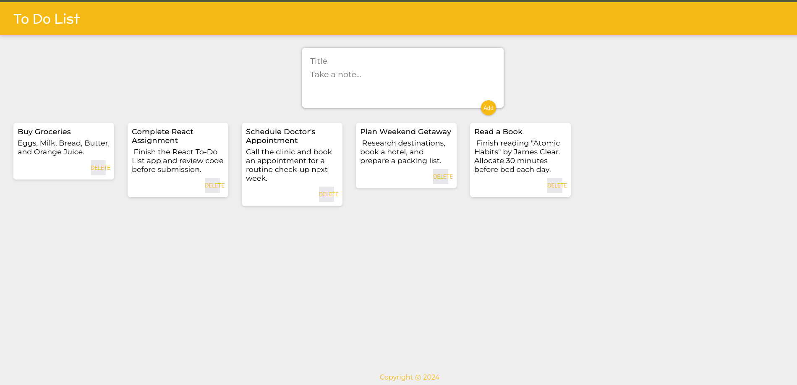

# To-Do List App

A simple and responsive To-Do List application built with React. This app allows users to add, view, and delete tasks.

## Table of Contents

- [Demo](#demo)
- [Features](#features)
- [Installation](#installation)
- [Usage](#usage)
- [Technologies Used](#technologies-used)

## Demo

## Features

<ul>
  <li>Add new tasks with a title and content.</li>
  <li>View a list of tasks.</li>
  <li>Delete tasks individually.</li>
  <li>Responsive design.</li>
</ul>

## Installation

<ol>
  <li>Clone the repository:
    <pre><code>git clone https://github.com/godfreydekew/keeperApp.git

cd keeperApp</code></pre>
  </li>
  <li>Install dependencies:
    <pre><code>npm install</code></pre>
  </li>
  <li>Start the development server:
    <pre><code>npm start</code></pre>
  </li>
</ol>

The app will run on <a href="http://localhost:3000">http://localhost:3000</a>.

## Usage

<ul>
  <li>To add a task, fill in the title and content fields, then click "Add".</li>
  <li>To delete a task, click the "DELETE" button on the respective task.</li>
</ul>

## Technologies Used

<ul>
  <li><strong>React:</strong> Frontend framework for building user interfaces.</li>
  <li><strong>CSS:</strong> Styling the application.</li>
</ul>